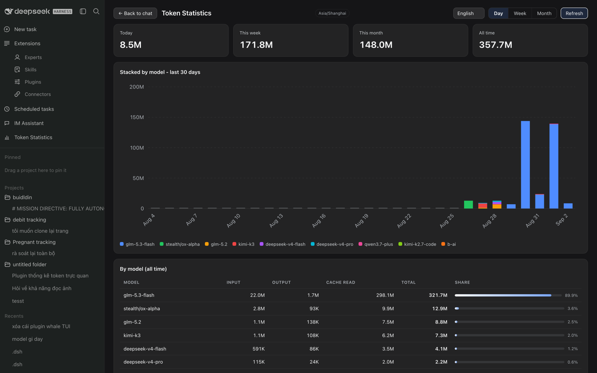

# dsh-token-stats

Token usage dashboard for the [DeepSeek Harness](https://github.com/deepseek-ai/deepseek-harness) web GUI — displayed directly inside the app. No extra collection: it reads the 365-day local ledger the built-in **Wallet** plugin already records (every AI call: model, provider, day, input/output/cache tokens, cost when priced).

English · [Tiếng Việt](#tiếng-việt) · [中文](#中文)

## Features



- **Sidebar entry "Token Statistics"** — opens a full-width dashboard in the center column (same interaction model as the Task Board plugin); works in both the expanded sidebar and the compact rail.
- **Four summary cards** — Today / This week / This month / All time (tokens + cost when pricing data exists).
- **Stacked bar chart** — pure SVG, one color per model, daily (30 days) / weekly (12 ISO weeks) / monthly (12 months), hover tooltips per model, K/M-scaled axis.
- **Per-model table** — input, output, cache read, total, share bar; sorted by total.
- **4-language UI** — Tiếng Việt, English, 中文， 日本語. Language picker in the dashboard header; auto-detects the browser language on first run and remembers the choice.
- **Auto-refresh** — refetches every 30 s while the dashboard is open, plus a manual refresh button.
- **Zero dependencies, no build step** — host half is plain ESM Node; client half is a single pre-bundled CJS module.

## Install

```sh
dsh plugin --profile web add dsh-token-stats
```

Restart `dsh web` (or use the Market's one-click restart), then look for **Token Statistics** in the left sidebar.

Requires **dsh ≥ 0.1.1-rc.2** (the sidebar DOM it integrates with). Read-only: the plugin never writes to the Wallet ledger.

## How it works

- Host half registers `GET /api/token-stats/summary`: all-time totals from `~/.dsh/storages/wallet.json` `sessions`, and day/week/month series from its `history.events` (timezone-aware, mtime-cached).
- Client half mounts the sidebar entry (self-healing DOM injection) and the dashboard React view; charts are hand-rolled SVG — no chart library.

## Data notes

- All-time totals come from the Wallet session ledger; the day/week/month series come from the Wallet event ledger (capped at 20,000 events / 365 days by the Wallet plugin). Models without pricing show tokens only.

## Tiếng Việt

Dashboard thống kê token cho web GUI của DeepSeek Harness — hiển thị trực tiếp trong ứng dụng. Đọc sổ ghi 365 ngày có sẵn của plugin Wallet (mỗi lần gọi AI: model, ngày, token input/output/cache, chi phí khi có). Thẻ tổng quan Hôm nay / Tuần này / Tháng này / Tổng tất cả; biểu đồ cột xếp lớp theo model; bảng chi tiết từng model. Giao diện đa ngôn ngữ: Tiếng Việt, English, 中文， 日本語 — đổi ngay trong dashboard. Cài đặt: `dsh plugin --profile web add dsh-token-stats`, khởi động lại `dsh web`, mở mục "Thống kê Token" ở thanh bên.

## 中文

DeepSeek Harness Web GUI 的 Token 用量仪表盘 — 直接显示在界面内。读取内置 Wallet 插件的 365 天本地账本（每次 AI 调用：模型、日期、输入/输出/缓存 token、可用时的费用）。今日 / 本周 / 本月 / 累计四张汇总卡片；按模型堆叠的柱状图；模型明细表。界面支持越南语 / 英语 / 中文 / 日语，可在仪表盘内切换。安装：`dsh plugin --profile web add dsh-token-stats`，重启 `dsh web`，在侧边栏打开 "Token 统计"。

## Submit to the Plugin Market

See [docs/market-submission.md](docs/market-submission.md) — publish to npm, then PR one entry into the [awesome-dsh-plugin](https://github.com/awesome-dsh-plugin/awesome-dsh-plugin) catalog (the Market picks it up automatically, usually within a day).

## License

MIT — see [LICENSE](LICENSE).
